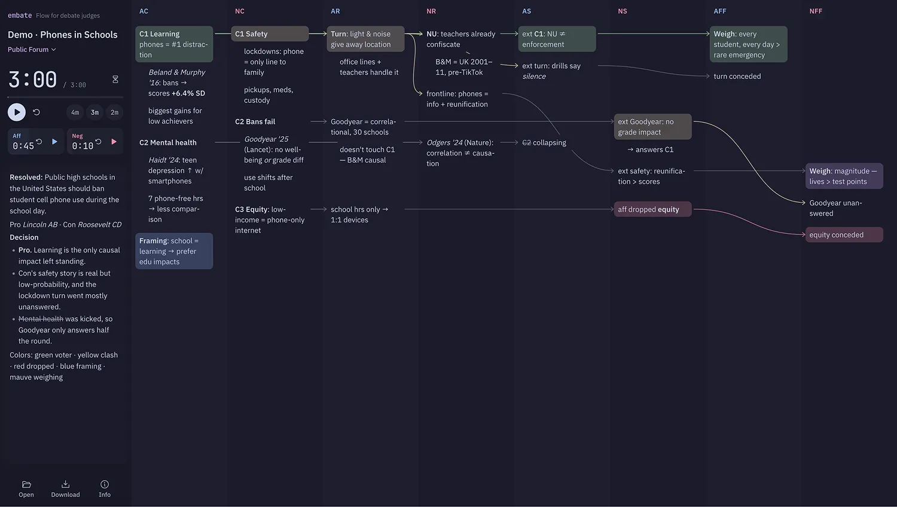

# embate

[debate.emtech.cc](https://debate.emtech.cc)



A flowing tool for debate judges. The sidebar holds the round's title, format, speech timer, prep clocks and notes; the board lays out one column per speech so you can write down arguments as you hear them and draw an arrow from each response to the argument it answers.

Formats: Public Forum, Lincoln–Douglas, Policy, British Parliamentary, World Schools, Asian Parliamentary and 新式奧瑞岡 (Oregon-Oxford). Switching format swaps in that format's speeches, quick timers and prep time.

Everything saves to your browser's localStorage as you type. You can also download a round as JSON and open it again later. Open → Demo loads a sample Public Forum round that uses every feature.

## Using it

- Click empty space in a column to add a point. `Enter` adds the next point, `Shift Enter` breaks the line, and `Tab` adds a sub-point (on a point you just added and left empty, `Tab` nests it under the one above).
- Drag a point up or down to move it together with its sub-points; drag sideways to change how deep it's nested.
- Hover a point, or the space to its right, to show its arrow. Click the arrow to extend the point into the next speech, or drag it onto any later speech or point to link there. `⌘ Enter` extends too. Click a link to remove it.
- Points take Markdown and the usual shortcuts (`⌘B`, `⌘I`, `⌘⇧X`). Right-click a point to color, unlink or delete it.
- Click a speech label to rename it. Click the format under the title to switch formats.
- The aff and neg prep clocks sit under the main timer; click the digits to change them, or press `⌥[` and `⌥]` to start or pause them.
- Columns fill the board by default. Pinch on a trackpad to widen or narrow them.
- `⌘/` opens Info, which lists every shortcut.

## Development

Requires Node.js and pnpm (see `packageManager` in `package.json` for the version).

```sh
pnpm install
pnpm dev          # dev server
pnpm build        # type-check and build to dist/
pnpm format       # Prettier
```

Built with React, React Router, Zustand, TanStack Query, Milkdown, Base UI, Motion and Phosphor Icons. Colors follow Catppuccin (Latte and Mocha, matching the system theme), and styles are CSS Modules.

`wrangler.jsonc` serves `dist/` as Cloudflare Workers static assets with a single-page-app fallback on the custom domain `debate.emtech.cc`. To deploy:

```sh
pnpm build
npx wrangler deploy
```

## License

Licensed under the [Apache License 2.0](https://www.apache.org/licenses/LICENSE-2.0). See [LICENSE](./LICENSE).
